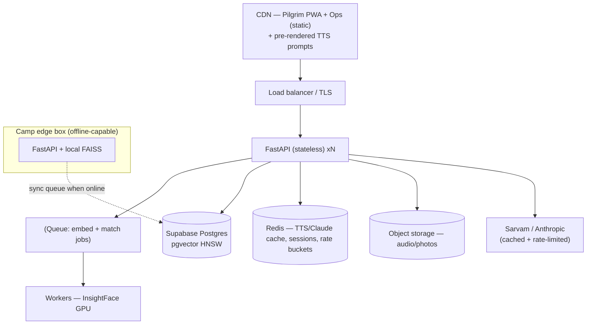

# SETU — Infrastructure & Scaling

Target reality: **Nashik–Trimbakeshwar Simhastha 2027, ~80M pilgrims**, thousands of separations/day,
spiking 4–5× on Amrit Snan days, with networks that collapse near the ghats. So the design goal is:
**scale horizontally in the cloud AND keep working offline on a camp edge box.**

Judges score *Deployability* and *System design* — this is where we win points. Two mantras:
1. **Stateless API + shared stores** → add replicas on snan days, drain them after.
2. **Cache and precompute the predictable** (fixed UI prompts, embeddings) so external APIs aren't the bottleneck.

---

## What to do NOW (cheap, high-leverage)
1. **Make the API stateless.** The in-memory `db/faiss_index.py` dict is per-process — fine for the
   demo, fatal for >1 replica. Back the registry with **Supabase pgvector** as the source of truth;
   keep FAISS only as the *edge/offline* mirror. (Role 1 + Role 2.)
2. **Cache the fixed UI TTS.** Every pilgrim screen speaks a *fixed* sentence per language (~12
   languages × ~6 prompts = ~72 clips). Pre-render with Bulbul once, ship as static audio on a CDN.
   `/speak` then serves known prompts for **free, instantly** — this removes ~90% of TTS calls.
3. **Pick a cheaper extraction model.** `claude-haiku-4-5` for `extract_profile`/`rerank`; reserve
   `claude-opus-4-8` for the live demo. Add **prompt caching** on the fixed system prompt.
4. **Move media out of responses.** Store audio/photos in object storage (Supabase Storage / S3),
   return references — never inline base64 in JSON or logs (also a privacy win, §12).
5. **One Docker image, deploy it.** `Dockerfile` is ready (uv). Ship to Fly.io / a VPS now so there's
   a live URL for judging; the *same* image is the camp edge box.

## Target architecture (scale)

## Component scaling notes
| Layer | Now | At scale |
|---|---|---|
| **API** | 1 uvicorn | Stateless, N replicas behind LB; autoscale on snan days; `--workers` per box |
| **Vector search** | FAISS brute force / in-memory | **pgvector HNSW** (or IVFFlat) in Supabase; **block/partition by zone & age-band** to shrink the candidate set (the dedup engine already blocks) |
| **Heavy ML** | inline | Offload InsightFace embedding + matching to a **queue + GPU workers** (Arq/RQ/Celery); API stays fast |
| **Speech (Sarvam)** | per-request | Pre-render fixed prompts to CDN; cache by text hash in Redis; batch; upgrade tier for snan peaks |
| **Reasoning (Claude)** | per-request | Haiku for extraction, prompt caching, batch where possible |
| **DB** | direct | Supabase **pooler/pgbouncer**, read replicas, TTL-purge cron (`ttl_expires_at`, §12) |
| **Frontend** | vite dev | Static build on CDN; Capacitor APK distributed offline to kiosks |
| **Offline** | — | Edge container + local FAISS + **sync queue** (last-write-wins); the network-cut demo |

## Deployment options (pick one for the live URL)
- **Fly.io** — easiest multi-region for a single container; secrets via `fly secrets set`. Good default.
- **VPS (Hetzner/DO)** — `docker compose up` behind Caddy/Traefik for auto-HTTPS. Cheapest, matches "runs on a cheap VPS".
- **Cloud Run / ECS** — autoscaling managed containers if you want hands-off snan-day scaling.
- **Camp edge box** — the *same* image with `OFFLINE_MODE=true` + local FAISS; syncs when a link is available.

Managed deps: **Supabase** (Postgres + pgvector + storage + pooler) covers DB, vectors, and media in one.

## Secrets & CI
- Never commit keys (`.env` is gitignored). Use the platform's secret store (`fly secrets`, repo Actions secrets).
- **GitHub Actions:** on push to `main`, build the image, push to GHCR, deploy. (1 workflow file — add under `.github/workflows/`.)
- HTTPS is mandatory for the pilgrim mic (`getUserMedia` needs a secure context) — terminate TLS at the LB/Caddy.

## Observability & resilience
- `/health` already reports key/offline status — wire it to the platform health check + autoscaler.
- Add structured logging (no PII, §12), request metrics, and a TTL-purge job.
- Rate-limit external calls per IP/centre (Redis token bucket) so a snan-day surge can't exhaust Sarvam/Anthropic credits.

## Scale checklist
- [ ] Registry in pgvector (HNSW), API stateless · [ ] Fixed TTS prompts pre-rendered to CDN
- [ ] Embedding/match on a queue + GPU workers · [ ] Media in object storage
- [ ] Redis cache + rate limits · [ ] TTL purge cron · [ ] Live deploy + edge image · [ ] CI/CD + secrets
