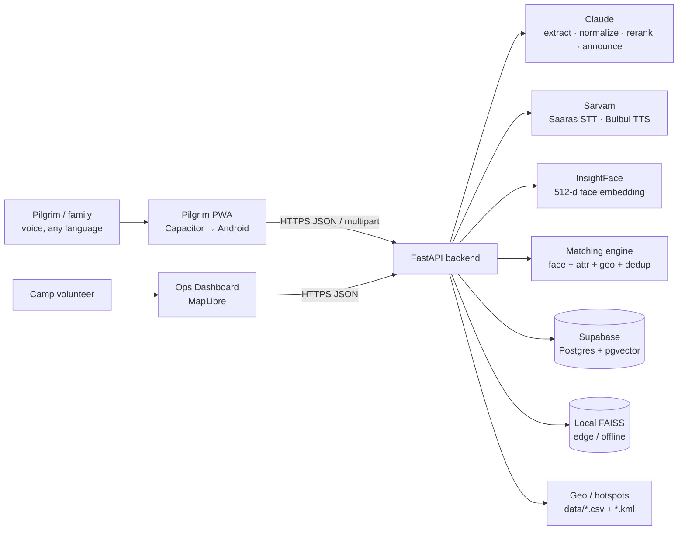
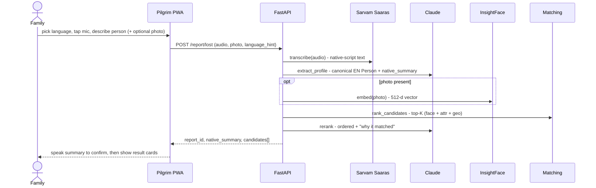
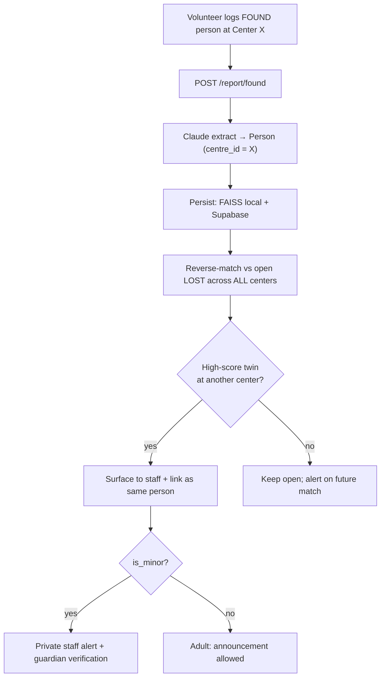
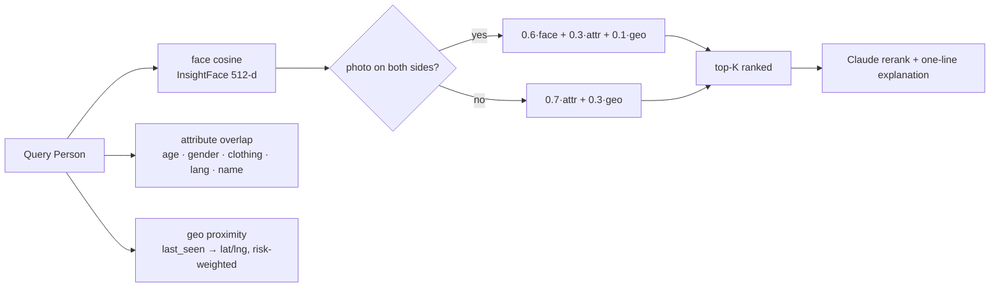
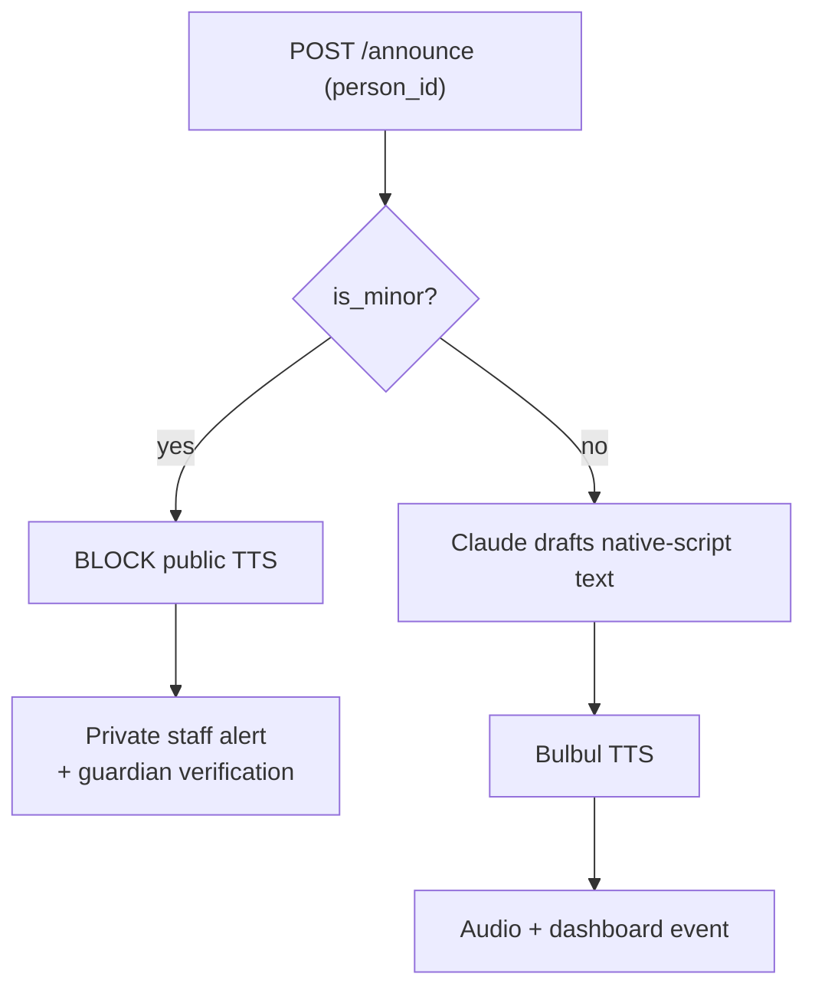
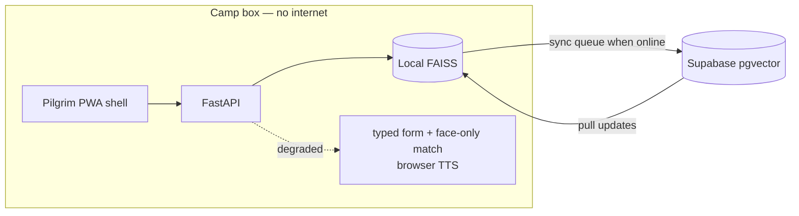
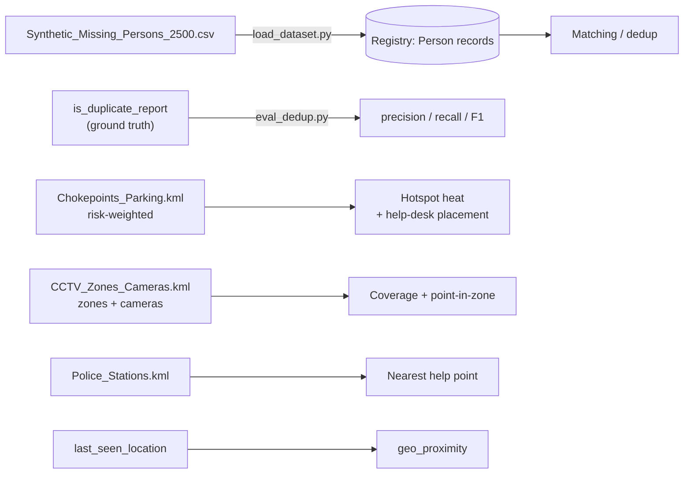
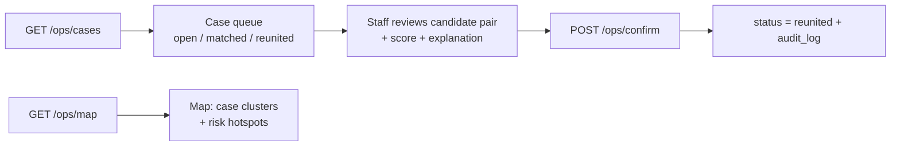

# SETU — System & Data Flow

How a report moves through SETU, end to end. Pairs with [SETU_BUILD_SPEC.md](SETU_BUILD_SPEC.md)
(the *what*), [DATA.md](DATA.md) (the datasets), and [ROLES.md](ROLES.md) (who builds what).
Diagrams are Mermaid and render on GitHub.

## 1. System context

## 2. Report a lost person — the core pilgrim flow

Cross-language is automatic: the family may speak Hindi while the found-person was logged in
Tamil — Claude normalizes both to canonical English fields, so matching just works.

## 3. Report a found person + cross-center dedup — the dataset's hero problem

This closes the real gap: a person logged at Center A is matched against a family searching at
Center B. Measure it with `is_duplicate_report` (see §7).

## 4. Matching engine (`services/matching.py`)

Never a hard binary match — always ranked top-K with a confidence breakdown + a human
explanation a volunteer can confirm in seconds.

## 5. Announcement + child safety (§12)

## 6. Offline / edge resilience (§13)

If Saaras/Claude are unreachable: fall back to the typed/attribute path + local match, show a small
"ऑफलाइन मोड" banner, keep working. Records queue and sync (last-write-wins) on reconnect.

## 7. Data & geo pipeline

## 8. Ops dashboard flow

